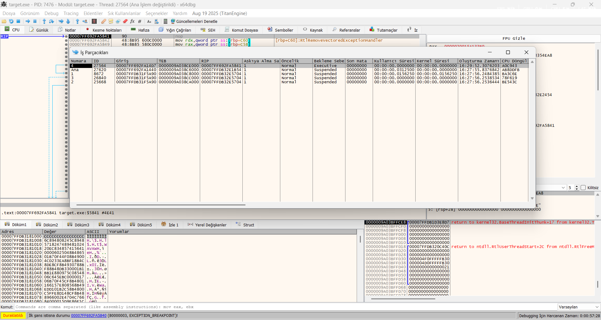
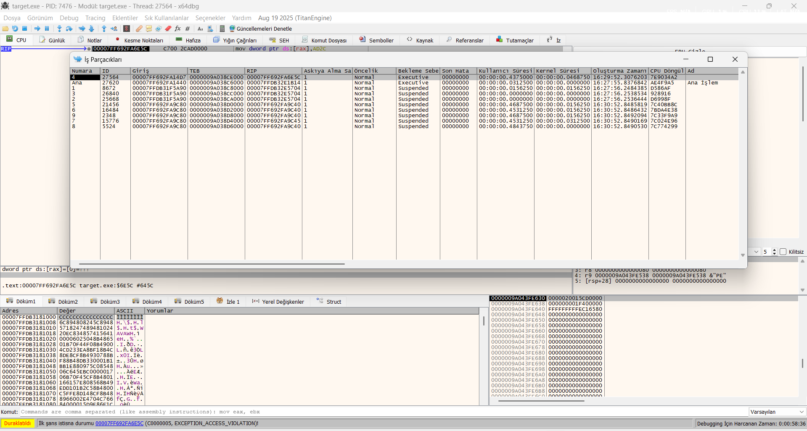
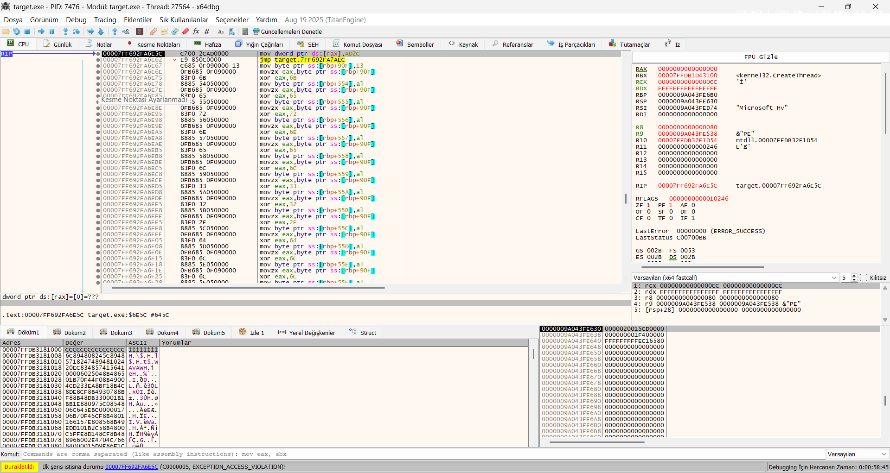
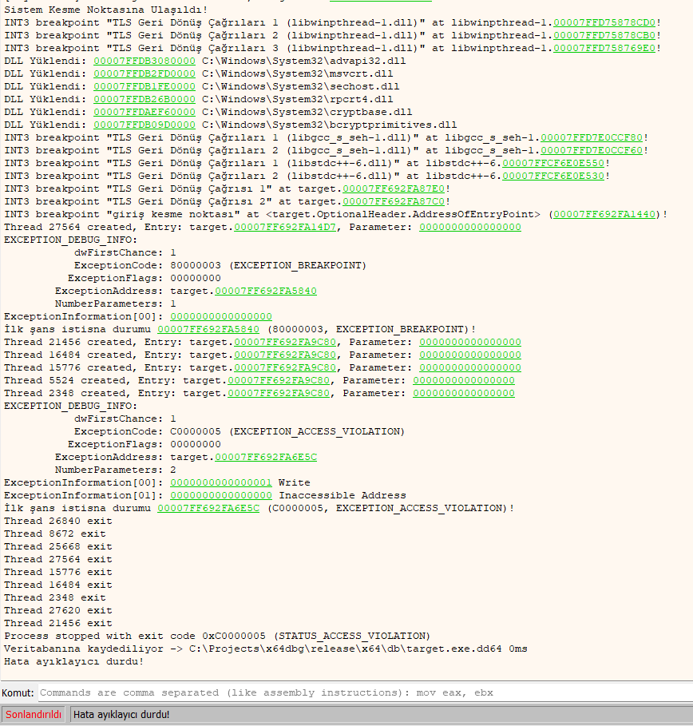
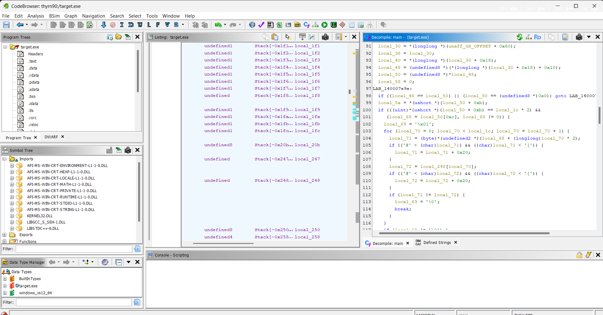

# OPAQUE 🛡️

[]() 
[](LICENSE) 
[]() 
[]()

**Zero-IAT Anti-Analysis & Custom VCPU Engine for Indie Developers**

Opaque is a highly aggressive, header-only C++ defense mechanism designed to protect indie games and software from reverse engineering, debugging, and memory dumping. 

It does not rely on standard API calls, and it does not play nice. Opaque builds its own execution environment, masks its core logic through a custom bytecode interpreter, and actively punishes analysis attempts by melting down the tools trying to read it.

> ⚠️ **DISCLAIMER:** This project is provided for educational purposes, authorized security research, and IP protection for independent developers. The author (thyrn90) is not responsible for any system crashes (BSOD), hardware freezes, data loss, or misuse of this software. By using Opaque, you acknowledge that it performs intentional access violations, deep memory modifications, and aggressive memory allocations by design.

---

## ⚙️ The Arsenal (Features)

* **Custom Virtual CPU (VCPU):** The core logic is completely hidden behind a custom bytecode interpreter. Decompilers (like Ghidra/IDA) will only see a meaningless `switch-case` loop processing random hex values, turning a 3-day bypass job into a 3-month nightmare.
* **Zero-IAT & PEB Walking:** Opaque does not use the Import Address Table (IAT). It manually resolves necessary APIs (like `CreateThread`, `VirtualAlloc`) by stealthily walking the Process Environment Block (PEB) at runtime.
* **Aggressive Anti-Debugging (The RAM Bomb):** If a debugger (e.g., x64dbg) or a hook is detected, Opaque spawns decoy threads and allocates a massive 500MB `PAGE_READWRITE` memory block filled with `0xCC` (INT3). It then intentionally triggers an Access Violation (`0xC0000005`), effectively locking up or crashing the analysis tool and destroying the debug session.
* **Delayed Chaos:** To psychologically frustrate analysts, Opaque doesn't crash immediately upon detection. It sleeps for a randomized duration before triggering the payload, making it impossible to trace the exact detection point chronologically.
* **Anti-Dump:** If the environment is clean, Opaque wipes the DOS (`MZ`) and NT (`PE`) headers of the running process from memory, causing memory dumpers (like Scylla) to fail instantly.

---

---

---

## 📸 Visual Proof (The Meltdown Sequence)

Opaque does not play nice with debuggers. When it detects an active analysis session, it initiates a total meltdown. Here is the step-by-step destruction of an x64dbg session.

### 1. The Trap Springs (Exception Triggered)
The moment Opaque detects the debugger, it forces a breakpoint exception to seize control.


> *Status Bar shows `EXCEPTION_BREAKPOINT`. Opaque has woken up.*

### 2. The Decoy Swarm (Ghost Threads)
Before crashing, Opaque spawns multiple decoy threads running infinite junk-math loops to confuse the analyst's thread view.


> *The Threads (İş Parçacıkları) window is flooded with suspended and active decoy threads generated by `_K40S()`.*

### 3. The Execution (Fatal Access Violation)
Opaque intentionally writes to a NULL pointer (`0x00000000`), forcing the operating system to forcefully terminate the process, ripping it out of the debugger's hands.


> *CPU View showing `EXCEPTION_ACCESS_VIOLATION`. The debug session is officially dead.*

### 4. The RAM Bomb (Resource Exhaustion)
While the debugger is crashing, Opaque has already allocated and filled a massive memory block to paralyze memory scanners.


> *Task Manager confirms `target.exe` instantly consuming exactly **500.7 MB** of RAM filled with `0xCC` (INT3) bytes.*

### 5. The Aftermath (Debugger Log)
The final state of the process as recorded by the x64dbg event log.


> *The log perfectly captures the sequence: Breakpoint -> Decoy Threads Created -> Access Violation -> All threads exit -> Process stopped with exit code `0xC0000005`.*

### Ghidra Blindness (Zero-IAT & Spagetti Code)

> **Key Details in Ghidra:**
> * **Left (Imports Tree):** Critical APIs like `VirtualAlloc` or `CreateThread` are completely missing from the Import Address Table (IAT).
> * **Right (Decompiler):** Ghidra fails to simplify the manual PEB walking (`unaff_GS_OFFSET + 0x60`) and turns our dynamic API resolution into an unreadable, obfuscated mess of pointers and raw memory shifts.

---

## 🚀 Quick Start (Integration)

Opaque is designed to be effortlessly integrated into any existing C++ project. No complex build systems or external dependencies.

1. Drop the `opaque.hpp` file directly into your project's source directory.
2. Include the header in your main entry file.
3. Call the initialization macro as the **first execution step** in your application.

```cpp
#include <iostream>
#include "opaque.hpp" // 1. Include the defense header

int main() {
    // 2. Initialize Opaque before anything else.
    // It will spawn a detached Ghost Thread and guard the background.
    OPAQUE_INIT();

    // 3. Your actual game or application logic follows here.
    std::cout << "Application is running securely." << std::endl;
    
    std::cin.get();
    return 0;
}
```

## Mutation (Critical Developer Steps)
Do NOT use Opaque out of the box for production without modifying the core signatures. If you use the public unmodified version, reverse engineers will quickly create automatic unpackers for it.

Open opaque.hpp and modify the following before compiling your release build:

Change the XOR_KEY: Replace the default 0x7381 with your own unique hex key.

Re-encrypt Strings: If you change the internal byte-array decryption keys (e.g., char k = 0x13;), you must manually XOR your target strings (kernel32.dll, VirtualAlloc, etc.) with your new key and update the hex arrays in the code.

Modify the VCPU ISA: Change the hex values in the _OPCODES enum and shuffle the _BYTECODE array. This creates a unique Instruction Set Architecture specifically for your app, rendering generic static analysis useless.

---

## 🧪 Testing Status & Call for Contributors

Opaque has been extensively tested and proven lethal against User-Mode (Ring-3) debuggers, memory dumpers, and standard analysis tools (x64dbg, Ghidra, ScyllaHide) on bare-metal Windows environments.

**Note on Advanced VMs & Hypervisors:** While the core logic for VM/Hypervisor detection (CPUID, timing checks) is implemented, it has not been heavily stress-tested against deep Ring-0 evasion tools like **HyperHide** or custom nested malware analysis labs. 

If you have a dedicated reverse-engineering lab, I invite you to put Opaque to the test. Fork the repo, test the VM fingerprinting limits, and feel free to open an Issue or Pull Request. Let's make this shield unbreakable together.

* **Note on Game Engine Integration:** Opaque is currently an experimental Proof of Concept (PoC) tested primarily on standalone C++ binaries. Integrating this directly into heavy commercial engines (Unity/Unreal) may conflict with their built-in Crash Reporters or cause VCPU performance overhead. It is strongly recommended to initialize Opaque outside of active rendering loops.

* **Note on Desktop/UI Applications:** While Opaque runs flawlessly with near-zero overhead on standard, native C++ desktop applications, caution is advised for modern UI frameworks. Integrating Opaque into multi-process architectures (like Electron/CEF) or strictly sandboxed environments (like Windows UWP) may break Inter-Process Communication (IPC) or conflict with internal JIT memory managers due to its aggressive header wiping and memory manipulation.
---

## ⚖️ License
This project is licensed under the MIT License - see the LICENSE file for details.
